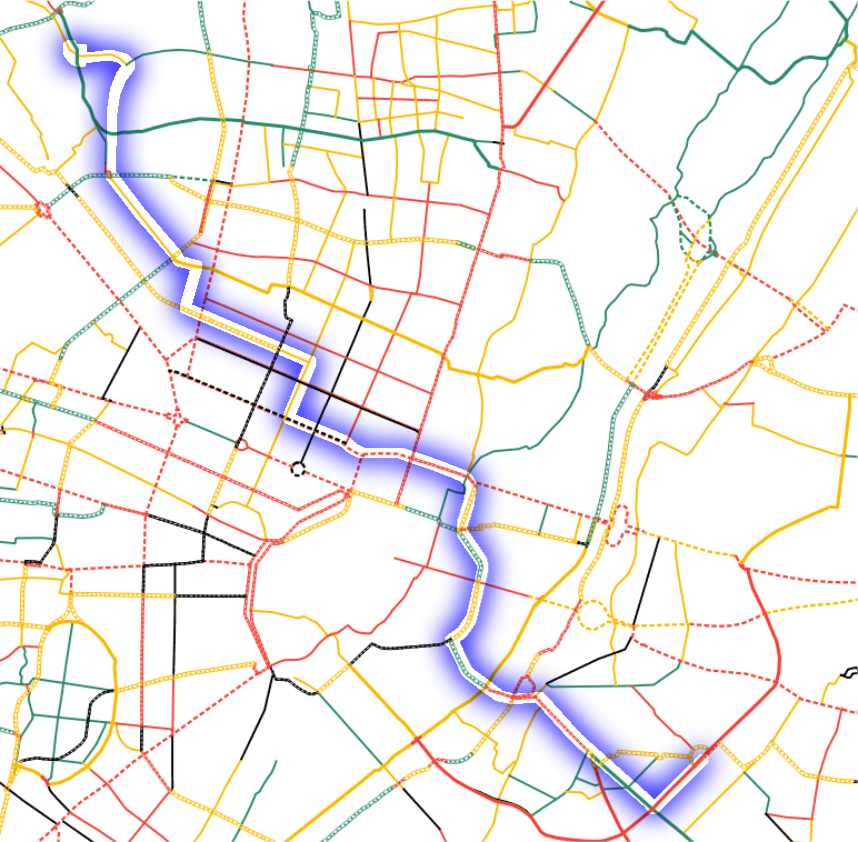

# munichways - routing

This project uses rated bikepath segments from www.munichways.com to render improved routing data for the OSRM backend.

## comparison

Let's compare existing routing algorithms with the one supported by the munichways.com annotations.

I chose a route going from Olympiapark to Ostbahnhof and calculated the route via conventional OSM and Google Maps. Eventually, I computed the route with the improved munichways routing.

### existing OSM routing

### existing Google Maps routing

### improved munichways routing

## usage

### requirements

- Python 3.8 with pip packages:
  - shapely
  - osmium
  - geopy
  - progress
- Docker

### prepare data

Run `./prepare.sh` to trigger the download of all needed input data (~200Mb).
After that, a python script will merge the ratings from munichways.com with the OSM data for Munich.
Eventually, different docker containers will be run to use OSRM tools to prepare the data for routing.

### run routing service

`./serve.sh` will run the OSRM backend (port 5000) and a frontend application (port 9966). Once docker containers are up and running, you can use the routing application via http://localhost:9966/
